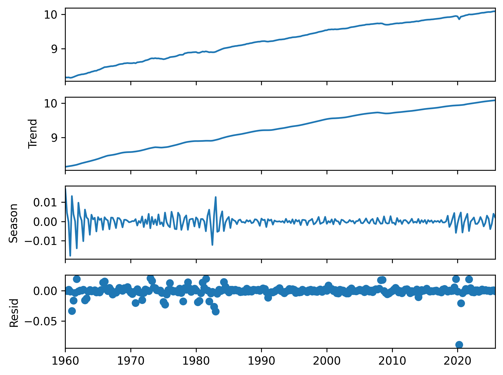
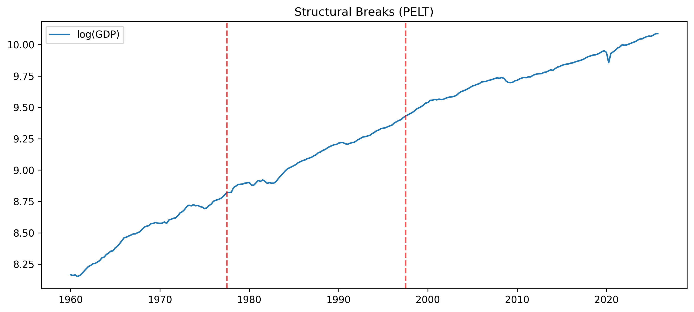

# Time Series Diagnostics & Decomposition Toolkit

This project implements a diagnosis-first workflow for time series analysis, including decomposition, stationarity testing, structural break detection, and uncertainty quantification.

## Overview

This repository was developed as part of ECON 5200 (Applied Data Analytics) and demonstrates both analytical reasoning and production-level implementation of time series methods.

Key components include:

- STL decomposition with log-transform correction for multiplicative data
- ADF and KPSS stationarity testing with proper specification
- MSTL decomposition for multi-seasonal data
- Structural break detection using the PELT algorithm
- Block bootstrap for trend uncertainty estimation
- A reusable Python module (`src/decompose.py`)
- Visual outputs for interpretation and validation

---

## Features

### 1. STL Decomposition
- Applies log transformation for multiplicative data
- Uses robust fitting to reduce outlier influence

### 2. Stationarity Testing
- Combines ADF and KPSS tests
- Uses correct regression specification (trend vs no trend)
- Provides a 2×2 decision framework

### 3. Structural Break Detection
- Implements PELT algorithm (ruptures)
- Identifies regime changes in macroeconomic data

### 4. Bootstrap Uncertainty
- Moving block bootstrap preserves autocorrelation
- Produces confidence intervals for trend estimates

---

## Example Outputs

### STL Decomposition


### Structural Breaks


### Bootstrap Confidence Bands


---

## Installation

Install dependencies:

```bash
pip install -r requirements.txt
